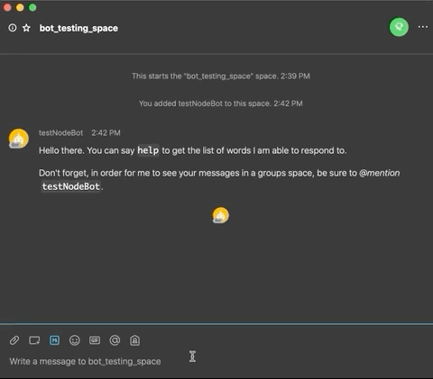

# Webex Pomodoro Chatbot

### This is a work in progress, core functionality is still being implemented

A Webex Teams node.JS bot application that keeps track of your [pomodoro](https://todoist.com/productivity-methods/pomodoro-technique) session and utilises Microsoft's [adaptive cards](https://adaptivecards.io/) to provide frequent "check ins" to keep track of the team's general mood.

One of the most challenging aspects of working from home can be staying focused and motivated. It’s a lot easier if you are pair programming or working together on a group project, since there is a collective sense of accountability. But other times everyone is working on their own thing and self accountability becomes more difficult. One way to tackle this is with a group pomodoro session. Everyone works to the same schedule of working sessions and breaks, and frequent team checkins keep you connected to each other without needing to schedule frequent calls or meetings.

To use this bot, simply create a Webex teams space (or use an existing space), add all the members of your group, add the Pomodoro bot at pomobot@webex.bot and you are ready to start your session!

This app utilises the [webex-node-bot-framework](https://github.com/webex/webex-bot-node-framework).

## Prerequisites:

- node.js (minimum supported v8.0.0 & npm 2.14.12 and up)

- Sign up for Webex Teams (logged in with your web browser)

## Steps to get the bot working

1. Create a Webex Teams bot (save the API access token and username): https://developer.webex.com/my-apps/new/bot

2. Sign up for nGrok, then connect and start it on your machine (save the port number and public web address): https://ngrok.com/download

3. After installing ngrok, run it on your local machine to get a public ip address, eg `ngrok http 3000 --region=eu`

4. Copy the ip address displayed in the ngrok window, ie: : https://1234.eu.ngrok.io

5. Copy the `config-template.json` file to a file called `config.json`

6. Edit `config.json` with the following values:

- token - Set this to the token for your bot that you got in step 1
- port - Set this to the port you set when you started ngrok in step 3 (ie: 3000)
- webhookUrl - Set this to the ip address that you copied in step 4

5. Turn on your bot server with `npm start`

6. Create a space in Webex Teams

7. Add the bot (by its username) to the space in Webex Teams
